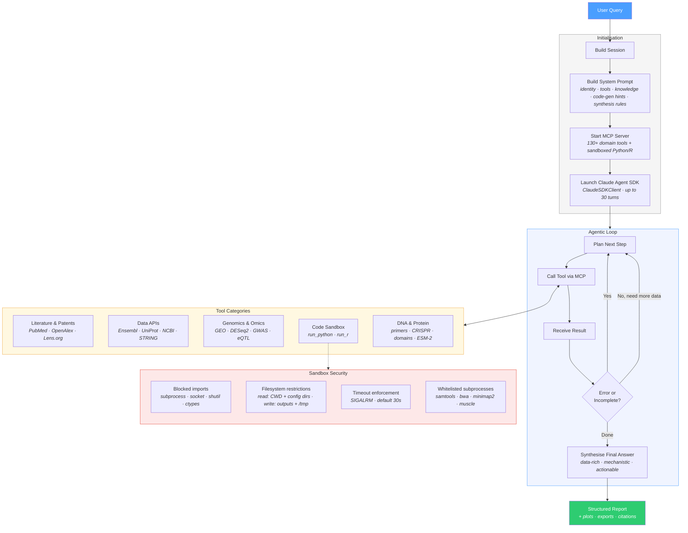

<p align="center">
  
</p>

# Harvest

An autonomous agent for plant science research. Like Claude Code, but for biology.

Harvest takes natural language questions about genes, species, and traits — then plans a multi-step research workflow, selects the right tools, executes them across species, and returns data-backed conclusions with citations.

```
  ██╗  ██╗ █████╗ ██████╗ ██╗   ██╗███████╗███████╗████████╗
  ██║  ██║██╔══██╗██╔══██╗██║   ██║██╔════╝██╔════╝╚══██╔══╝
  ███████║███████║██████╔╝██║   ██║█████╗  ███████╗   ██║
  ██╔══██║██╔══██║██╔══██╗╚██╗ ██╔╝██╔══╝  ╚════██║   ██║
  ██║  ██║██║  ██║██║  ██║ ╚████╔╝ ███████╗███████║   ██║
  ╚═╝  ╚═╝╚═╝  ╚═╝╚═╝  ╚═╝  ╚═══╝  ╚══════╝╚══════╝   ╚═╝
                       .---.      ,,  ,,  ,,  ,,  ,,  ,,  ,,
                  .---|   |----.  ||  ||  ||  ||  ||  ||  ||
  ..  ..  ..  ..  |   '---'    |= ||  ||  ||  ||  ||  ||  ||
                 (O)===========(o) ||  ||  ||  ||  ||  ||  ||
```

## Quick Start

```bash
pip install -e .
ag setup              # configure API key
ag "your question"    # single query
ag                    # interactive mode
```

## Key Capabilities

Harvest ships with **130+ research tools** across plant genomics, molecular biology, and computational biology.

| Category | Tools | Examples |
|----------|------:|---------|
| **Genomics** | 12 | Gene annotation, ortholog mapping, co-expression networks, GFF3 parsing, GWAS/QTL lookup, variant annotation |
| **Editing** | 2 | CRISPR guide design (PAM enumeration, off-target scoring), editability assessment with paralogy analysis |
| **Literature** | 7 | PubMed plant-focused search, Lens.org patent search, OpenAlex, preprint search, ChEMBL literature |
| **Interactions** | 1 | STRING protein-protein interaction networks (plant species supported) |
| **Omics** | 22 | DESeq2, pathway enrichment, GEO search/fetch, proteomics, spatial transcriptomics, multi-omics integration |
| **DNA** | 10 | ORF finding, codon optimization, primer design, Golden Gate/Gibson assembly, restriction analysis |
| **Expression** | 6 | Differential expression, pathway scoring, TF activity inference, immune deconvolution |
| **Data APIs** | 15 | Ensembl, MyGene, UniProt, NCBI, Open Targets, Reactome, PDBe, and more |
| **Protein** | 3 | Domain annotation (InterPro), function prediction, ESM-2 embeddings |
| **Single Cell** | 3 | Clustering (Leiden/Louvain), cell type annotation, trajectory inference |
| **Data** | 2 | Dataset listing, expression data loading |
| **Statistics** | 3 | Enrichment analysis, dose-response fitting, survival analysis |

## Example Queries

```bash
# Gene function across species
ag "What is the function of FT orthologs in rice and wheat? Compare regulatory elements."

# Ortholog mapping
ag "Map the Arabidopsis gene AT1G65480 to its orthologs in maize, tomato, and soybean."

# CRISPR assessment
ag "Design CRISPR guides for OsGW2 in rice. Flag paralogs and assess editability."

# Evidence gathering
ag "Find recent papers and patents on drought tolerance QTLs in wheat."
```

## Architecture

Harvest is built on the **Claude Agent SDK** agentic loop. A natural language query goes to Claude, which plans the research workflow, calls tools via an in-process MCP server, self-corrects on errors, and synthesizes findings into a structured report — all within a single agentic session (up to 30 tool-use turns). See [CLAUDE.md](CLAUDE.md) for implementation details.



## Species Support

Harvest includes a YAML species registry with **20+ species** covering major crops, model plants, and reference organisms:

*Arabidopsis, rice, maize, wheat, soybean, tomato, potato, canola, tobacco, poplar, barley, sorghum, medicago, lotus, banana, cassava, strawberry, cotton, grape* — plus human, mouse, rat, yeast, and zebrafish for comparative genomics.

```bash
ag species list       # view full registry with taxon IDs and genome builds
```

## Data Management

```bash
ag data pull depmap        # download a dataset for local use
ag data pull prism
ag data pull msigdb
```

Local datasets are optional — Harvest works out of the box using 15+ database APIs (Ensembl, UniProt, PubMed, STRING, etc.) with no setup required. Local data enables deeper analysis tools that operate on bulk expression and dependency matrices.

## Known Limitations

- **PlantExp dataset URLs** — Plant expression dataset download URLs are pending upstream availability.
- **Editability regulatory scoring** — The regulatory/epigenetic layer of editability assessment is a stub; currently returns structural and paralogy metrics only.
- **Off-target scanning** — CRISPR off-target detection uses regex-based PAM matching, not full genome alignment.

